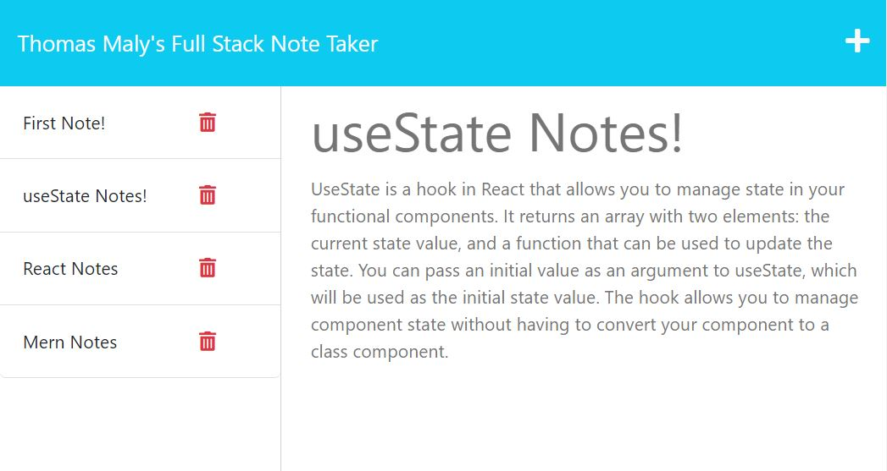

# Note-taker-11

## Description

A note application where you can create new notes, read previous notes, and delete any notes.

## Table of Contents

- [Installation](#installation)
- [Usage](#usage)
- [Credits](#credits)
- [License](#license)

## Installation

- express

## Usage

After clicking on "notes" on the main page, you can add, delete, or read notes.

https://

## Credits

- Rutgers University Coding Bootcamp

## License

N/A